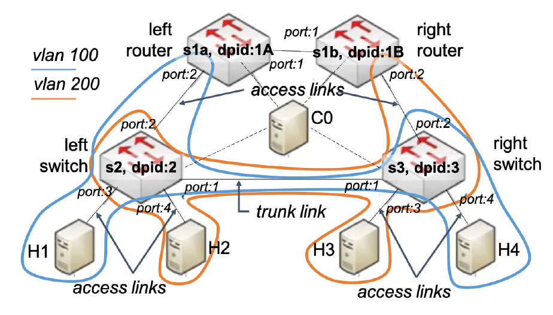

# Static Routing with Two Routers VLAN

**This project has been implemented within the scope of the Software Defined Networks (SDN) course using the Ryu framework and the OpenFlow Protocol.**

The Topology consists of 2 L3 Routers and 2 L2 Switches.. The structure of the 2 VLANs are presented below:

The script extends a previous controller designed for static routing with two routers to handle VLAN encapsulation and forwarding in a network topology involving switches and routers.
The network consists of left and right switches with datapath IDs 0x2 and 0x3, respectively.
Two VLANs are created: VLAN 100 using the IP network 192.168.1.0/24 and VLAN 200 using the IP network 192.168.2.0/24.

The left router, with datapath ID 0x1A, acts as the gateway for VLAN 100, having the IP address 192.168.1.1 at its interface connected to the left switch.
Similarly, the right router, with datapath ID 0x1B, serves as the gateway for VLAN 200, with the IP address 192.168.2.1 at its interface connected to the right switch.

Packets passing through access links are not VLAN encapsulated, while the trunk link handles VLAN encapsulation.
MAC addresses are assigned to the interfaces of routers and switches accordingly.

The script extends the controller to perform the following tasks:

1. **Receive and Forward Packets from Access Ports:**
   - Handle packets received from access ports and forward them based on normal Layer 2 functionality.
   - Encapsulate packets with the appropriate VLAN ID if they are to be forwarded to a trunk link.

2. **Receive and Forward Packets from Trunk Ports:**
   - Process packets received from trunk ports and forward them based on normal Layer 2 functionality.
   - Decapsulate packets from the VLAN header if they are to be forwarded to an access link.

The script ensures that packets exchanged between hosts within the same VLAN traverse the trunk link if the hosts are connected to different switches. However, packets exchanged between hosts in different VLANs are routed through the routers.

